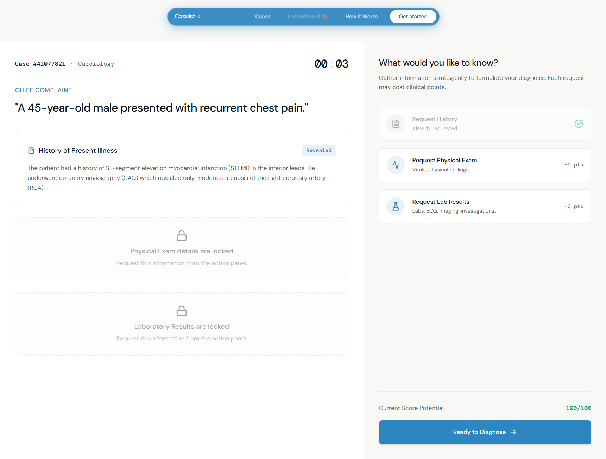
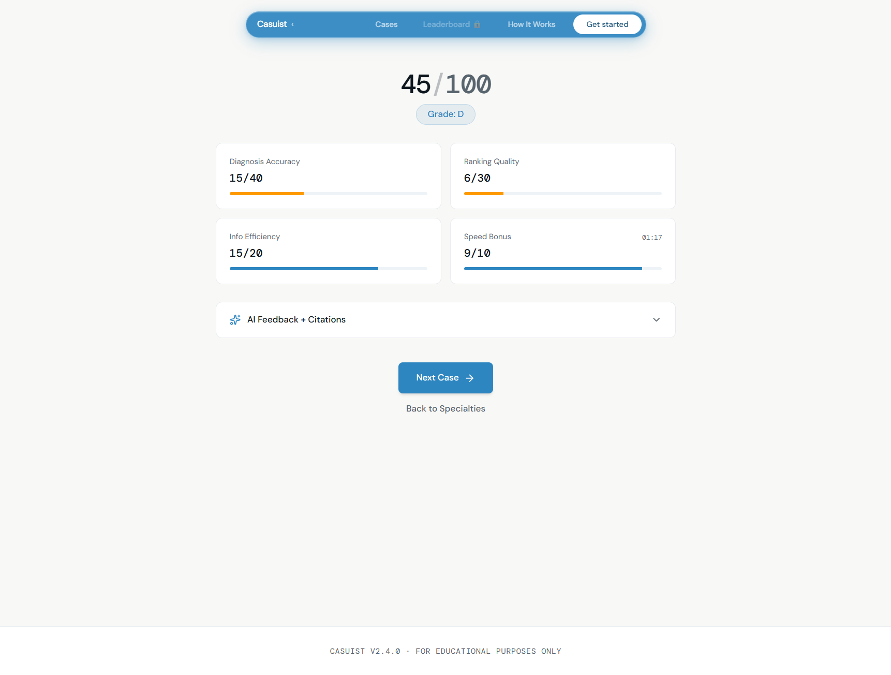

# Casuist

**Clinical case-based learning for allied health students — built like LeetCode, grounded in real PubMed cases.**

🔗 **Live demo:** https://casuist.vercel.app · **Telegram bot:** @CasuistBetaBot (free to use, 607 cases)

---

## Why I built this

I'm a biomedical engineering student who wanted to get hands-on with modern AI development — specifically LLMs, RAG pipelines, and building full-stack apps with AI tooling. I needed a real project to learn on, not a tutorial.

Casuist was that project. The idea made sense to me: medical and allied health students need to practice clinical reasoning, and most platforms that do this are expensive, passive, or built only for doctors. I figured the intersection of biomedical engineering and software was exactly the right place to build something like this — and it turned out to be one of the best ways to learn both fields at once.

The goal was never to ship a startup. It was to build something real, learn the full stack from data pipeline to deployed product, and see if the idea had legs. It did — Reddit beta got real nursing students using it and sending DMs. That was enough validation to call it done and move on.

---

## What is Casuist?

Casuist is a web app and Telegram bot that helps nursing, pharmacy, and allied health students practice diagnostic reasoning using real clinical case reports sourced from PubMed Central.

You work through cases the way a clinician would — read the chief complaint, decide what information to request, form your differential diagnosis, and get scored on your reasoning. Every case is derived from a real open-access PubMed case report.

---

## How it works

**1. Pick a specialty**
Choose from Cardiology, Respiratory, Neurology, Endocrinology, or Gastroenterology.

**2. Read the chief complaint**
You start with only the presenting complaint — no history, no labs, no exam findings yet.

**3. Request information strategically**
Decide what to request: History, Physical Exam, or Lab Results. Each request beyond history costs points — efficiency matters.

**4. Rank your differentials**
Rank 5 possible diagnoses from most to least likely. The ranking panel stays visible alongside the case so you can refer back to clinical details while deciding.

**5. Get scored and reviewed**
Score is calculated across four components. Expand the AI feedback panel for a clinical reasoning breakdown with PubMed citations.

---

## Screenshots

### Landing page


### Specialty selection — 607 cases across 5 specialties


### Case view — progressive reveal with locked sections


### Case view — all sections revealed, ready to diagnose


### Ranking differentials


### Scorecard with AI feedback


---

## Scoring system

| Component | Points | Notes |
|-----------|--------|-------|
| Diagnosis accuracy | 40 | Full marks for correct #1 diagnosis |
| Ranking quality | 30 | Positional scoring across all 5 differentials |
| Info efficiency | 20 | Penalises requesting everything blindly |
| Speed bonus | 10 | 10/10 under 60s, -1 per 30s after |

Grades: A (90–100) · B (75–89) · C (60–74) · D (<60)

Scoring is fully deterministic TypeScript — no LLM involved in grading, zero hallucination risk in scores.

---

## Tech stack

### Backend (Python / FastAPI)
- **FastAPI + Uvicorn** — REST API serving cases and feedback
- **Groq API** — `llama-3.3-70b-versatile` for clinical feedback, `llama-3.1-8b-instant` for case generation
- **LlamaIndex + ChromaDB** — RAG pipeline (local dev only)
- **HuggingFace** `BAAI/bge-small-en-v1.5` — local embeddings, no API cost
- **Biopython** — PubMed/NCBI API access via BioC
- **python-telegram-bot** — Telegram bot interface

### Frontend (Next.js)
- **Next.js 14** + TypeScript, App Router
- **Tailwind CSS**
- **Lucide React** icons
- DM Sans + DM Mono fonts

### Deployment
- **Railway** — FastAPI backend (stripped ML deps for deployment)
- **Vercel** — Next.js frontend

---

## Data pipeline

607 structured cases were generated through a multi-stage pipeline:

1. **Fetch** — 660 open-access case reports pulled from PubMed Central via the BioC API using Biopython
2. **Process** — BioC JSON parsed into structured sections (History, Exam, Labs, Diagnosis) with flexible alias matching to handle inconsistent journal headings. 616 cases passed processing (93% pass rate)
3. **Chunk + embed** — Section-based chunking with metadata (PMID, specialty, section type). 949 chunks indexed in ChromaDB using local HuggingFace embeddings
4. **Generate** — Groq `llama-3.1-8b-instant` used to generate structured case JSONs (chief complaint, differentials, correct ranking) from processed PubMed content. 607 cases generated across 5 specialties

| Metric | Value |
|--------|-------|
| Raw PubMed JSONs | 660 |
| Processed cases | 616 |
| ChromaDB chunks | 949 |
| Structured cases | 607 |
| Specialties | 5 |

---

## Key technical decisions

**Ship before sophistication.** ChromaDB isn't running on Railway (local file store, not cloud-compatible) so production feedback uses direct Groq API calls rather than RAG retrieval. The tradeoff is documented and accepted — validating the learning loop mattered more than perfect citation grounding at this stage.

**Deterministic scoring.** Scores are calculated in TypeScript using pure math, not an LLM. Consistent, fast, zero hallucination risk in grading.

**Opt-in AI feedback.** Feedback loads only when the user clicks — prevents the UX problem of users tapping "Next Case" before a 2–3 second Groq response lands.

**Two deployment targets, two dependency files.** `requirements-railway.txt` strips LlamaIndex, HuggingFace, and torch — reducing Railway build time from timeout to under 3 minutes.

---

## Running locally

```bash
# Clone the repo
git clone https://github.com/ssyafq/Casuist
cd Casuist

# Backend
python -m venv .venv
.venv\Scripts\activate        # Windows
# source .venv/bin/activate   # Mac/Linux
pip install -r requirements-full.txt

# Add your keys to .env
# GROQ_API_KEY=...
# NCBI_EMAIL=...
# NCBI_API_KEY=...

uvicorn api.main:app --reload --port 8000

# Frontend (separate terminal)
cd casuist-web
npm install
npm run dev                   # localhost:3000
```

---

## What I learned

- **RAG deployment constraints are real.** ChromaDB's local file store is great for development but incompatible with stateless cloud deployment. Learned this the hard way mid-build.
- **Data cleaning is 80% of the work.** The BioC JSON structure varies wildly across journals — exact section header matching rejected 96% of cases until I switched to alias-based flexible matching.
- **Validate the loop before adding features.** The Telegram bot shipped first. Reddit beta (744 views, multiple DMs from nursing students) confirmed the concept before building the web app.
- **Opt-in > automatic for slow operations.** Making AI feedback a click rather than auto-load eliminated the UX problem of users leaving before feedback arrived.

---

## Status

This project is parked as a portfolio piece. The core concept is validated and the full stack is live and functional. No further feature development is planned.

---

*Educational purposes only — not a substitute for clinical training.*